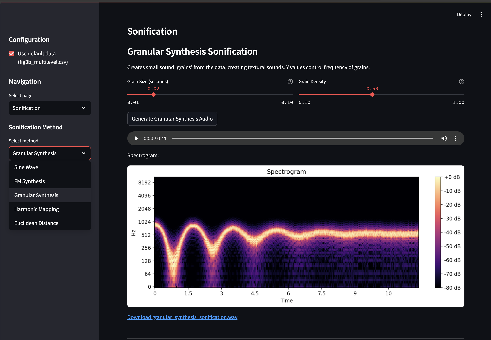
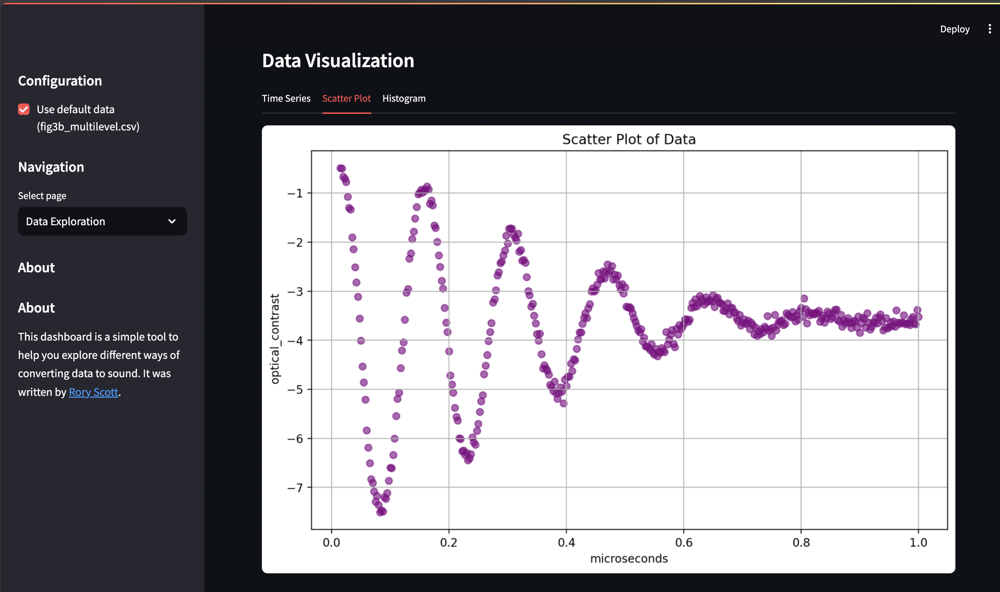

# Rabi Oscillation Sonification

A data sonification tool that converts quantum physics data (specifically Rabi oscillation patterns) into sound. This project allows you to explore different methods of sonification through an interactive Streamlit dashboard.



## Overview

This application provides multiple sonification strategies to transform data into sound:
- **Sine Wave**: Maps data to simple sine wave tones
- **FM Synthesis**: Uses frequency modulation for more complex sounds
- **Granular Synthesis**: Creates textural sounds from small sound "grains"
- **Harmonic Mapping**: Maps data to harmonic content for rich timbral variations
- **Euclidean Distance**: Sonifies the distance between consecutive data points

The dashboard also includes data visualization tools to help you understand your data before sonifying it.




## Installation and Running

### Option 1: Using Docker (Recommended)

Prerequisites:
- Docker installed on your system

Steps:

1. Clone this repository:
   ```bash
   git clone https://github.com/yourusername/rabi-oscillation-sonification.git
   cd rabi-oscillation-sonification
   ```

2. Build and run the Docker container:
   ```bash
   make up
   ```
   
   This will build the Docker image and start a container running the Streamlit app.

3. Access the dashboard in your browser at:
   ```
   http://localhost:8501
   ```

Other useful Docker commands:
```bash
make logs     # View container logs
make stop     # Stop and remove the container
make clean    # Remove container and image
```

### Option 2: Running Directly with Streamlit

Prerequisites:
- Python 3.12+
- pip or uv package manager

Steps:

1. Clone this repository:
   ```bash
   git clone https://github.com/yourusername/rabi-oscillation-sonification.git
   cd rabi-oscillation-sonification
   ```

2. Create and activate a virtual environment:
   ```bash
   uv venv
   source .venv/bin/activate  # On Windows: .venv\Scripts\activate
   ```

3. Install dependencies:
   ```bash
   uv sync
   ```

4. Run the Streamlit app:
   ```bash
   streamlit run dashboard.py
   ```

5. Access the dashboard in your browser at:
   ```
   http://localhost:8501
   ```

## Usage

1. When you first open the dashboard, it will use the default dataset (`fig3b_multilevel.csv`).
2. Explore the data in the "Data Exploration" tab, which shows statistics and visualizations.
3. Switch to the "Sonification" tab to convert the data to sound.
4. Select a sonification method from the sidebar.
5. Adjust parameters to change how the data is sonified.
6. Click the "Generate" button to create and play the audio.
7. Download the generated audio file for further use.

## Data Format

The application expects CSV files with at least two columns:
- The first column is typically a time or x-coordinate value
- The second column is the data to be sonified (typically y-coordinate values)

Example:
```csv
microseconds, optical_contrast
1.500000000000000118e-02, -4.925499858765510774e-01
1.750000000000000167e-02, -4.933005565083004584e-01
2.000000000000000042e-02, -6.617802563678457650e-01
```

## Project Structure

- `dashboard.py` - Main Streamlit application
- `data/` - Contains sample data files
- `Dockerfile` & `Makefile` - For containerization and automation

## Dependencies

- streamlit
- numpy
- pandas
- matplotlib
- librosa
- scipy
- and others (see `pyproject.toml` for full list)

## License

MIT

## Contact

[Rory Scott](https://github.com/rorads)
